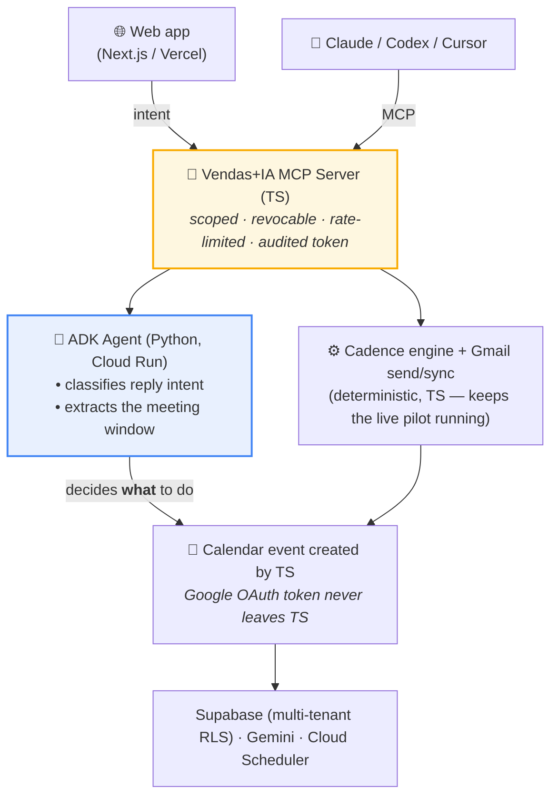

# Vendas+IA — the AI sales agent for people who never sold

> Run your entire B2B outbound — leads, emails, replies, meetings — by talking to an AI agent.

**Vendas+IA** (Portuguese for "Sales+AI") is an autonomous B2B email prospecting agent built for the people who build the product but aren't salespeople: indie devs, vibe coders, SaaS founders, and domain experts who need their first customers.

- 🌐 **Live app:** https://www.vendasmaisia.com
- 🎥 **Demo video:** https://youtu.be/aKX7wyC7MK4
- 🏆 **Submission:** Google for Startups AI Agents Challenge — Track 1 (Build)

---

## What it does

- **Enrichment agent** — describe your ideal customer in one sentence ("veterinarians in São Paulo") → a warm, validated lead list in ~2 minutes.
- **Cadence engine** — generates and sends founder-to-founder email sequences from your own Gmail, at a human-safe rhythm.
- **AI inbox** — when a lead replies, the agent reads the full thread, classifies intent, and answers automatically in the lead's language.
- **Books the meeting** — extracts the date/time and creates the event directly in **Google Calendar**, with zero manual work.
- **Run it by talking** — a published **MCP server** lets you drive everything from Claude, Codex, or Cursor: _"how's my funnel this week?"_, _"draft a campaign for SaaS CTOs"_, _"pause campaign X"_.

## Architecture



The ADK reply agent is **additive and behind a feature flag** (`USE_ADK_REPLY`), with a TypeScript engine as fallback, so the live pilot never breaks. The user's Google OAuth token **never leaves the TS backend** and is never passed into the Python agent — the agent decides *what* to do, the backend does it.

## Why it's different

1. **MCP in both directions** — we both *consume* MCP tools (Google Calendar) and *publish* our own B2B MCP server, so a non-technical founder runs real sales ops from inside their AI coding tool.
2. **Declarative intent** — the web app and Claude/Codex send *intents*; the agent decides *how*. Same brain, two front doors.
3. **Self-improving via evals** — we don't just hope the agent is good; we measure it against a human gold standard and tune from there.
4. **Multi-tenant RLS** — enterprise-grade workspace isolation from day one.

## Evals (real metrics, before → after tuning)

Measured against a human gold standard on 200 real customer conversations + a 30-conversation human-reviewed set (same intent-classification task the agent runs in production; these conversations were on WhatsApp, the product ships on email):

| Metric | Before | After |
|---|---|---|
| Overall accuracy | 29.5% | **62.0%** |
| Meeting-intent detection (F1) | 43.5% | **84.1%** |
| Meeting extraction (F1) | 40.0% | **77.8%** |
| Human-gold accuracy | 6.7% | **63.3%** |

See [`evals/report.md`](evals/report.md) for methodology and honesty notes.

## Stack

Next.js 16 · React 19 · TypeScript · Tailwind CSS 4 · Python · **Google ADK** · **Gemini** (Vertex AI for the TS pipeline; Gemini API for the ADK agent) · **Google Cloud Run** · **Cloud Scheduler** · Google Calendar API · Gmail API · Supabase (Postgres + RLS) · Model Context Protocol (MCP) · Vercel

## Development

```bash
npm install
npm run dev      # http://localhost:3000
npm run build    # validation
```

The reply agent lives in [`services/adk-agent/`](services/adk-agent/) (Python). Eval harness in [`evals/`](evals/).

## Scheduling

**Cloud Scheduler** triggers the cadence/sync engine every few minutes:

```txt
GET https://www.vendasmaisia.com/api/cron/email-engine
Authorization: Bearer CRON_SECRET
```

## Security

- Server-side only: `SUPABASE_SERVICE_ROLE_KEY`, `GOOGLE_CLIENT_SECRET`, `GEMINI_API_KEY`, `CRON_SECRET`. Never in the browser.
- `NEXT_PUBLIC_SUPABASE_ANON_KEY` must be a publishable/anon public key, never `sb_secret_*`.
- Google OAuth tokens stay server-side and are never returned to the browser or passed into the Python agent.
- MCP tokens are scoped, revocable, rate-limited, and every action is audited.
